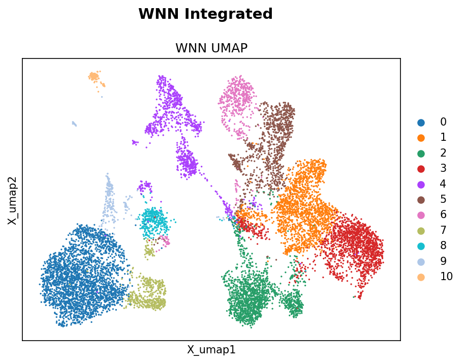
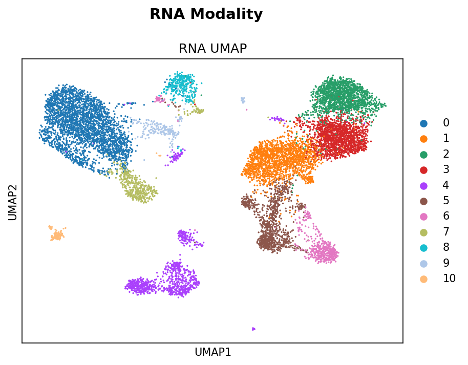
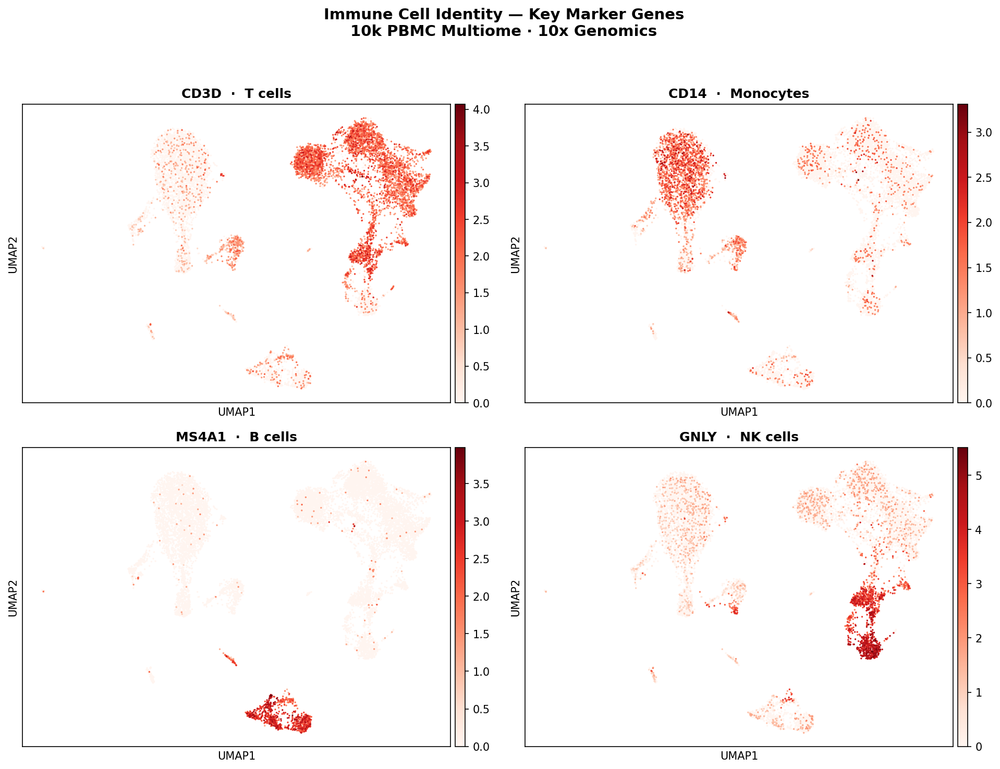
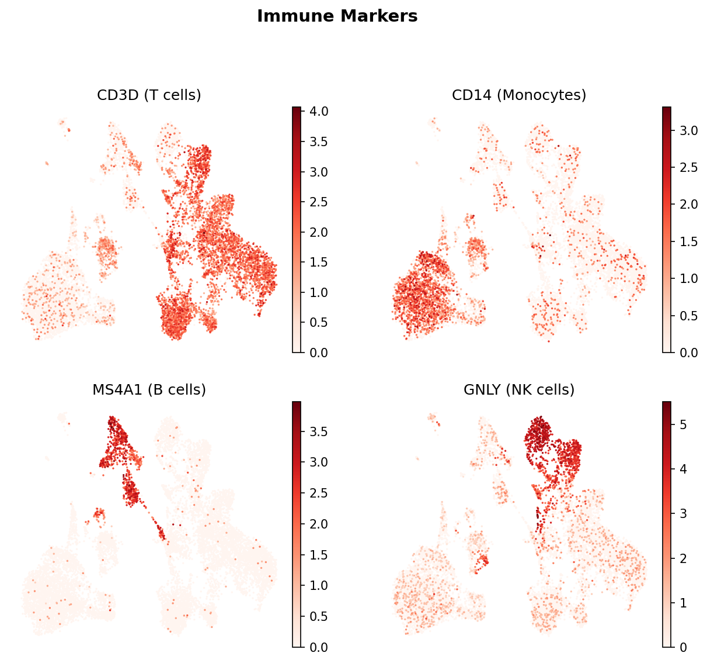
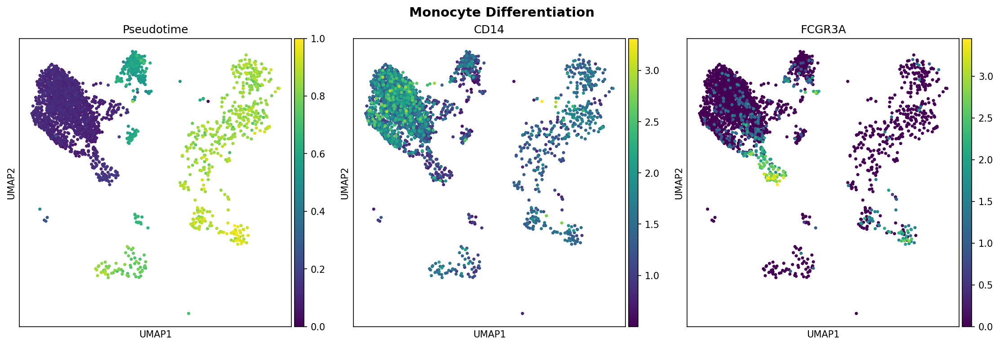

# Single-Cell Multi-Omics Pipeline for Inflammation Analysis


## 📽️ Project Overview

This repository contains a reproducible, containerized bioinformatics pipeline for the analysis of **single-cell multi-omics data (scRNA-seq + scATAC-seq)**. The workflow is built using **Snakemake** and utilises **Scanpy** and **Muon** for the integration of transcriptomic and chromatin accessibility modalities.

### 🔬 Biological Context

**Research Question:** *How does chromatin accessibility landscape correlate with gene expression heterogeneity in human peripheral blood mononuclear cells (PBMCs) under inflammatory conditions?*

This pipeline targets the **10x Genomics Multiome (RNA + ATAC)** dataset to:
1. Identify distinct immune cell subsets (T-cells, B-cells, Monocytes, NK cells).
2. Correlate chromatin accessibility at promoter regions with gene expression.
3. Highlight regulatory elements potentially driving inflammatory responses in specific cell populations.

## 🛠️ Pipeline Architecture

```
Raw Data (10x HDF5 + ATAC Fragments)
        │
        ▼
   ┌─────────┐
   │   QC    │  ← Filter low-quality cells, remove doublets
   └────┬────┘
        │
        ▼
   ┌───────────────┐
   │ Preprocessing │  ← Normalize, Log1p, HVG selection
   └──────┬────────┘
          │
          ▼
   ┌──────────────┐
   │  Dim. Reduc. │  ← PCA (RNA), LSI (ATAC), UMAP
   └──────┬───────┘
          │
          ▼
   ┌──────────────┐
   │  WNN Integr. │  ← Weighted Nearest Neighbor (RNA + ATAC)
   └──────┬───────┘
          │
          ▼
   ┌──────────────┐
   │  Clustering  │  ← Leiden algorithm on WNN graph
   └──────┬───────┘
          │
          ▼
   ┌──────────────┐
   │   Plotting   │  ← UMAP, Dotplots, QC metrics
   └──────────────┘
```

### What is WNN Integration?
**Weighted Nearest Neighbor (WNN)** integration jointly embeds RNA and ATAC modalities by learning cell-specific weights for each modality. Cells where chromatin accessibility is more informative get higher ATAC weight; cells with cleaner gene expression get higher RNA weight. This produces a more biologically accurate cell embedding than either modality alone — critical for identifying rare immune subsets in inflammatory contexts.

## 📂 Repository Structure

```
singlecell-multiomics-pipeline/
├── config/             # Configuration files
│   └── config.yaml
├── workflow/           # Snakemake workflow definition
│   ├── Snakefile
│   └── rules/
│       ├── qc.smk
│       └── analysis.smk
├── envs/               # Conda environment definitions
│   └── sc-omics.yaml
├── scripts/            # Analysis scripts
│   ├── analysis.py
│   ├── qc_check.py
│   └── download_data.sh
├── results/            # Output plots and tables (not committed)
├── data/               # Input data directory (not committed)
├── Dockerfile
└── README.md
```

## 🛰️ Usage

### Tested Environment
- Python 3.9
- `numpy==1.26.4`
- `scanpy==1.9.3`
- `anndata==0.8.0`
- `muon` (compatible release)
- `leidenalg`, `pandas`, `matplotlib`, `seaborn`

> **Note:** These versions are pinned in `envs/sc-omics.yaml` to avoid ecosystem drift between `muon`, `anndata`, and `numpy`.

### Installation

1. Clone the repository:
   ```bash
   git clone https://github.com/QntmSeer/singlecell-multiomics-pipeline.git
   cd singlecell-multiomics-pipeline
   ```

2. Create the environment:
   ```bash
   conda env create -f envs/sc-omics.yaml
   conda activate sc-omics
   ```

### Running the Workflow

1. Download the data:
   ```bash
   bash scripts/download_data.sh
   ```

2. Run the pipeline:
   ```bash
   snakemake --cores 4
   ```

3. If you encounter Snakemake cache issues, clean and retry:
   ```bash
   rm -rf .snakemake
   snakemake --cores 4
   ```

## 📊 Expected Outputs

| Output | Location | Description |
|--------|----------|-------------|
| QC Metrics | `results/qc/qc_metrics.txt` | Per-cell QC summary (generated at runtime) |
| MultiQC Report | `results/qc/multiqc_report.html` | Aggregated QC (generated at runtime) |
| RNA UMAP | `example_results/umap_rna.png` | UMAP based on RNA expression (WNN clusters) |
| ATAC UMAP | `example_results/umap_atac.png` | UMAP based on Chromatin Accessibility (LSI) |
| WNN UMAP | `example_results/umap_wnn.png` | Joint Multi-Modal Integration (Weighted Nearest Neighbors) |
| Marker Genes | `example_results/umap_markers.png` | Immune cell marker expression (CD3D, CD14, MS4A1, GNLY) |
| Pseudotime UMAP | `example_results/trajectory_pseudotime.png` | Continuous developmental timeline (Classical $\to$ Non-Classical) |

## 🖼️ Example Results

> Generated from 10k PBMC Multiome dataset (10x Genomics). **Phase 2 Update:** Now featuring true multi-modal integration (WNN).

**1. WNN Integrated UMAP (Best Separation)**


**2. RNA Modality UMAP**


**3. ATAC Modality UMAP**


**4. Immune Marker Genes**


**Phase 3: Trajectory Inference (Monocyte Differentiation)**
> Modeling the transition from **Classical Monocytes** ($CD14^{high}$) to **Non-Classical Monocytes** ($FCGR3A^+$) using PAGA and Diffusion Pseudotime. This demonstrates the pipeline's ability to unravel cellular heterogeneity and dynamic adaptation.

**5. Developmental Pseudotime**


## 🐳 Docker

```bash
docker build -t sc-omics-pipeline .
docker run -v $(pwd)/data:/app/data -v $(pwd)/results:/app/results sc-omics-pipeline snakemake --cores 4
```

## 📄 License

This project is licensed under the MIT License — see the [LICENSE](LICENSE) file for details.

## 🔗 Data Source

[10k Human PBMCs, Multiome v1.0, Chromium X - 10x Genomics](https://www.10xgenomics.com/datasets/10-k-human-pbm-cs-multiome-v-1-0-chromium-x-1-standard-2-0-0)
Licensed under [CC BY 4.0](https://creativecommons.org/licenses/by/4.0/).
